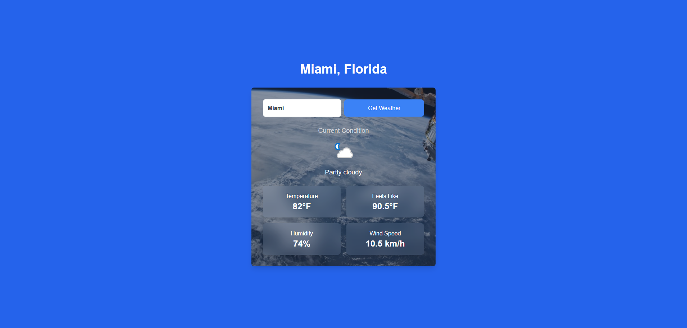

# Simple Get Weather Web App

## Overview
A web application that fetches real-time weather data for a given city. You can enter a city name to retrieve the current weather conditions for many things. This app currently shows the Current Condition, Temperature, Feels-Like Temperature, Humidity, and Wind Speed. Its a simple project that you can mess around with and easy to setup using sites like RapidAPI.

## Features
- Randomized background images for each session.
- Displays real-time weather data for any city entered.
- UI design for displaying weather information.
- Input sanitization to prevent security vulnerabilities.

## Technologies Used
- **Frontend**: Next.JS, React, Tailwind CSS, TypeScript
- **Backend**: Node.js, Weather API integration, Azure Functions
- **Security**: Validator.js for input validation
- **API**: WeatherAPI

## Installation
1. Clone the repository:

> git clone <repo-url>

### Install dependencies:

> npm install

### Set up your .env.local file with your API key:

> WEATHER_API_KEY=<your-api-key>

### Start the development server:

> npm run dev

# Security Features

- Input sanitization using Validator.js
- HTTPS and CSP are recommended for deployment.

# How to Use

1. Enter a city name in the input field.
2. Press the "Get Weather" button to retrieve weather data.
3. View the current conditions, temperature, humidity, and more.

# Future Enhancements

- Featured city list.
- Allow users to switch between Fahrenheit and Celsius.

# License

This project is licensed under the MIT License. See the [LICENSE](LICENSE) file for details.
